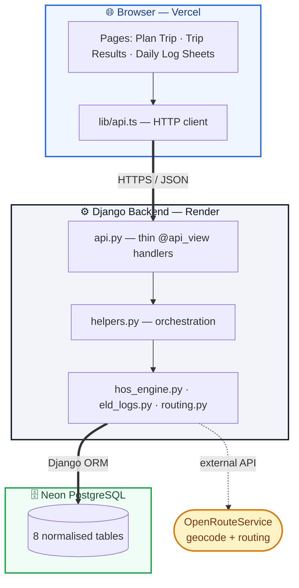

# RouteLog

Automated trip planning and FMCSA daily log generation for property-carrying drivers.

## Architecture

## Stack

- **Backend:** Django 5 + DRF + PostgreSQL
- **Frontend:** React 18 + TypeScript + Vite + Tailwind + Leaflet
- **Routing:** OpenRouteService (free tier)
- **Map:** OpenStreetMap via Leaflet

## Repo layout

    routelog/
    ├── backend/     Django project (routelog) + trips app
    └── frontend/    React + Vite app

## Local setup

### Backend

    cd backend
    python3 -m venv venv
    source venv/bin/activate
    pip install -r requirements.txt
    cp .env.example .env       # add your ORS_API_KEY
    python manage.py migrate
    python manage.py runserver

### Frontend

    cd frontend
    npm install
    cp .env.example .env
    npm run dev

Open http://localhost:5173.

## Tests

    cd backend
    pytest

27 tests covering the HOS engine and daily log splitter.

## HOS rules modeled (49 CFR Part 395)

- 11-hour driving limit per shift
- 14-hour on-duty window
- 30-minute break after 8 cumulative driving hours
- 10-hour off-duty reset
- 70-hour / 8-day cycle with 34-hour restart
- Fueling every 1,000 miles
- 1-hour pickup and dropoff
